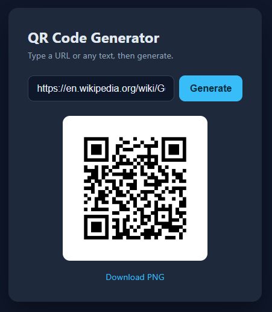
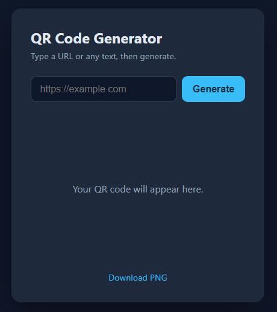

# QR Code Generator

> A full-stack web app that turns any URL or text into a downloadable QR code — built with Python and TypeScript, and shipped to Azure through a fully automated CI/CD pipeline.


---

<p align="center">
  
  &nbsp;&nbsp;
  
</p>
---

## Overview  

This project is a small but complete cloud application. The user enters a URL or any text, the backend generates a QR code as a PNG image, and the frontend displays it and offers a download. Behind the scenes, the app demonstrates a full DevOps workflow: the infrastructure is defined as code, and every push to the `main` branch automatically tests, builds, and deploys the app to Azure.

It was built as a hands-on way to practice the end-to-end loop of modern software delivery — from writing the code, to provisioning cloud infrastructure, to automating the release.

## Features

- Generate a QR code from any URL or text
- Download the result as a PNG image
- Clean, responsive single-page interface
- A documented REST API that returns QR codes as images
- Health-check endpoint for monitoring and automated testing
- Fully automated deployment — push to `main` and the app ships itself

## Tech stack

| Layer | Technology |
|-------|-----------|
| Backend | Python, FastAPI, qrcode, Pillow |
| Frontend | TypeScript, Vite, HTML/CSS |
| Hosting | Azure App Service (Linux) |
| Infrastructure | Azure Bicep (infrastructure as code) |
| CI/CD | GitHub Actions |
| Testing | pytest |

## How it works

```
git push  ->  GitHub Actions  ->  test  ->  build  ->  deploy to Azure  ->  live app
```

On every push to `main`, the GitHub Actions pipeline:

1. **Tests** the backend with pytest
2. **Builds** the TypeScript frontend with Vite
3. **Packages** the app together with its Python dependencies
4. **Deploys** it to Azure App Service
5. **Smoke-tests** the live health endpoint to confirm the app is up

The Azure infrastructure itself — the App Service Plan and the Web App — is defined in a Bicep template, so the whole hosting environment is reproducible and version-controlled rather than clicked together by hand.

## API reference

| Method | Endpoint | Description |
|--------|----------|-------------|
| `GET` | `/` | The web interface |
| `GET` | `/healthz` | Health check, returns `{"status": "ok"}` |
| `GET` | `/api/qr?data=<text>` | Returns a PNG QR code encoding `data` |

**Optional query parameters** on `/api/qr`:

| Parameter | Range | Default | Description |
|-----------|-------|---------|-------------|
| `box_size` | 1–40 | 10 | Pixel size of each QR module |
| `border` | 0–20 | 4 | Width of the quiet-zone border |

**Example**

```
/api/qr?data=https://example.com&box_size=10&border=4
```

This returns a PNG image of the QR code, which the frontend displays and lets the user download.

## Project structure

```
qr-code-generator/
├── app/                      # FastAPI backend
│   ├── main.py               # API routes + QR generation
│   ├── requirements.txt      # Python dependencies
│   └── test_main.py          # API tests
├── frontend/                 # TypeScript frontend
│   ├── src/main.ts           # Frontend logic
│   ├── index.html            # Page + styling
│   ├── package.json
│   ├── tsconfig.json
│   └── vite.config.ts
├── infra/                    # Infrastructure as code
│   ├── main.bicep            # Azure App Service definition
│   └── main.bicepparam       # Deployment parameters
├── .github/workflows/
│   └── deploy.yml            # CI/CD pipeline
└── README.md
```

## Running locally

**Backend**

```bash
cd app
pip install -r requirements.txt
python -m uvicorn main:app --reload --port 8000
```

The API is now available at `http://localhost:8000`.

**Frontend**

```bash
cd frontend
npm install
npm run dev
```

**Run the tests**

```bash
cd app
pip install pytest httpx
pytest
```

## Deployment

The infrastructure is provisioned once from the Bicep template:

```bash
az deployment group create \
  --resource-group <your-resource-group> \
  --template-file infra/main.bicep \
  --parameters appName=<your-app-name>
```

After that, deployment is automatic: every push to `main` triggers the GitHub Actions pipeline, which builds and deploys the latest version of the app to Azure.

To deploy from CI, two repository settings are needed:

- A **secret** `AZURE_WEBAPP_PUBLISH_PROFILE` — the publish profile from the Azure Web App
- A **variable** `AZURE_WEBAPP_NAME` — the name of the Web App

## What this project demonstrates

- Building and consuming a **REST API** with Python and FastAPI
- Working with a **TypeScript** frontend that talks to a backend over HTTP
- Defining cloud **infrastructure as code** with Azure Bicep
- Setting up a complete **CI/CD pipeline** in GitHub Actions
- Packaging and deploying a Python app to **Azure App Service**
- Writing **automated tests** and wiring them into the release process

## Possible next steps

- Expose the `box_size` and `border` options in the user interface
- Add QR code styling (colors, logos in the center)
- Store generated codes using Azure Storage or a database
- Add a staging environment and deploy there before production

---

Built as a learning project to practice full-stack development, cloud deployment, and CI/CD.
